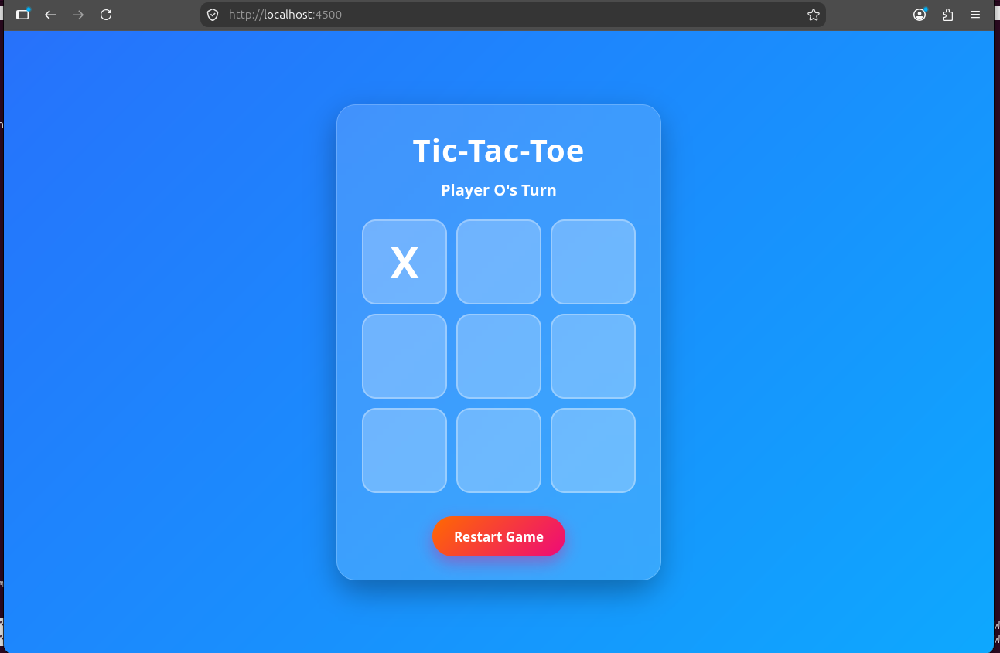

# 🎮 Linux Game Hosting Project

## Student Details

**Name:** Anusha Mohan

**Course:** DevOps & Cloud Computing

---

# Project Overview

This project demonstrates hosting a web-based Tic-Tac-Toe game using the Apache Web Server on Ubuntu Linux.

The game is developed using HTML, CSS, and JavaScript and hosted on **Port 4500**.

---

# Technologies Used

- Ubuntu Linux
- Apache2
- HTML5
- CSS3
- JavaScript
- Git
- GitHub

---

# Project Structure

```
game-hosting/
│
├── game/
│   ├── index.html
│   ├── style.css
│   └── script.js
│
├── apache/
│   └── game.conf
│
├── README.md
│
└── screenshot.png
```

---

# Installation Steps

## 1. Update Ubuntu

```bash
sudo apt update
sudo apt upgrade -y
```

## 2. Install Apache

```bash
sudo apt install apache2
```

## 3. Create Web Directory

```bash
sudo mkdir -p /var/www/game
```

## 4. Copy Game Files

```bash
sudo cp -r game/* /var/www/game/
```

## 5. Copy Apache Configuration

```bash
sudo cp apache/game.conf /etc/apache2/sites-available/
```

## 6. Enable the Website

```bash
sudo a2ensite game.conf
sudo systemctl restart apache2
```

## 7. Open the Application

```
http://localhost:4500/
```

---

# Apache Configuration

The VirtualHost configuration is included in:

```
apache/game.conf
```

The application is hosted using:

- Apache2
- Port 4500
- DocumentRoot: /var/www/game

---

# Features

- Responsive UI
- Modern Design
- Restart Button
- Winner Detection
- Draw Detection
- Interactive Gameplay

---

# Screenshot



---

# GitHub Repository

https://github.com/Anusha3Mohan/game-hosting
